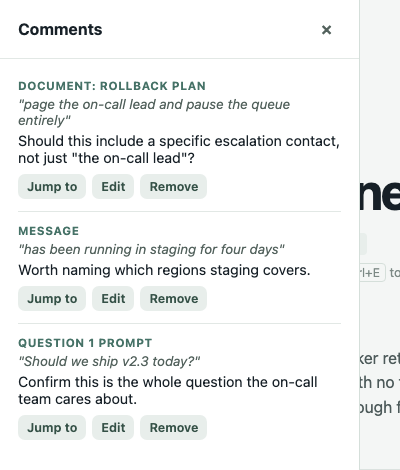

# ask-questions

`ask-questions` is a local blocking question form for agent workflows. A coding agent sends it a JSON request describing one or more questions; it opens a private page in your browser; you answer (and optionally annotate); it prints one JSON result to standard output when you submit or cancel.

## Install

This is a laptop-local tool, not a published package. It needs two sibling checkouts side by side:

```sh
git clone git@github.com:reid-kilgore/ask-questions.git
git clone git@github.com:reid-kilgore/criticmarkup.git
cd ask-questions
npm install
npm link
```

`criticmarkup` must sit next to `ask-questions` (i.e. `../criticmarkup` relative to this repository) before `npm install` — it is referenced from `package.json` as a local `file:` dependency, not a published one, because it is a small zero-dependency library this project's author also maintains. `npm install` fails without it present at that path. The server imports it directly, and also serves its single source file to the browser verbatim, since the browser has no bundler and no other client-side dependencies of its own.

`npm link` puts the `ask-questions` command on your `PATH`, pointing at this checkout. Confirm it worked:

```sh
ask-questions --help
```

`--help` is the complete contract a calling agent needs — payload schema, result shape, and behavior, all in one place. Read it before wiring this into an agent.

## Try it

```sh
ask-questions --file examples/request.json
```

This opens a browser page with a small multi-question batch. Answer the questions (or press Cancel) and the command prints the result JSON and exits.


A payload looks like this:

```json
{
  "version": 1,
  "message": "## Context\n\nInclude **relevant details** here.",
  "questions": [
    { "id": "summary", "prompt": "What is the main concern?", "type": "text" },
    { "id": "priority", "prompt": "What priority should this have?", "type": "single",
      "options": [{ "value": "high", "label": "High" }, { "value": "normal", "label": "Normal" }] }
  ]
}
```

Send it with `--json '...'`, `--file path.json`, or piped over stdin. `--help` has the full schema and several more worked examples, including supporting documents.

## Annotating, not just answering

The person answering isn't limited to filling in answers — they can comment directly on the text they're reading: a supporting document, the introductory message, or a question's prompt and option descriptions. This is aimed at review-style questions, where the useful response is "here's specifically what's unclear," not just a form field.

**To comment on something:** select the text (or, with no selection, just click into a paragraph, list item, or other block to focus it) and press **Cmd+E** (Ctrl+E off macOS). A small popup opens next to the selected text, marked with a dashed outline so it stays visible while you type; press Cmd/Ctrl+Enter to save, or Escape to cancel and discard both the comment and the outline. There's a quiet on-screen reminder of this the first time the page loads.


A comment always has both a highlight and text explaining it — there's no separate "just highlight, no comment" action. **Clicking an existing highlighted mark reopens the same popup**, pre-filled, to edit it. **Delete or Backspace removes it** while the mark has keyboard focus. A **Comments** button, top right of the main pane, opens a panel listing every comment made so far, with its own count; from there a comment can be jumped to, edited, or removed, wherever in the form it lives.



Annotating is entirely optional. It's never required to submit, and it never changes the shape of the `answers` result — see below.

### What the calling agent gets back

Alongside `answers`, the result carries a top-level `annotations` object — always present, defaulting to `{}` when nothing was annotated or the request was cancelled. Every leaf is the original text with the highlighted part wrapped in [CriticMarkup](http://criticmarkup.com/) and the comment attached right there, so the calling agent always sees the comment together with exactly what it's about:

```json
{
  "annotations": {
    "message": {
      "2-3": "a rewritten sentence would be {==clearer==}{>>say why<<}"
    },
    "documents": {
      "release-notes": {
        "4-5": "the {==rollback plan==}{>>this needs a specific runbook link<<} needs detail"
      }
    },
    "questions": {
      "decision": {
        "prompt": "Should we {==ship this release==}{>>waiting on the perf numbers<<}?"
      }
    }
  }
}
```

`message` and `documents` are keyed by the source Markdown line range the comment's block came from (e.g. `"2-3"`) — directly usable against the document the calling agent already holds. `questions` entries are keyed by question id, with `prompt` and/or `options.<value>` holding the annotated prompt or option description text.

## Documents, options, and other detail

Supporting documents use unique `id` and `title` values, and each has exactly one of inline `markdown` or a relative `path` (resolved against the payload file's directory for `--file`, or the current directory for `--json`/stdin — a document path can't escape that directory). The introductory `message`, documents, and option descriptions all accept Markdown; raw HTML is disabled and unsafe link schemes are neutralized. `--help` covers the full payload schema, including choice questions, the built-in `Other` free-text option, and required questions.

Every result also contains `askerPath`, the absolute directory the command was run from (a payload can't set or override it), shown in the browser as **Asked from**. Inside tmux, `askerTmuxWindow` is included too when the current window's name can be looked up.

There is no built-in answer timeout — a human can take hours. The command just blocks until Submit, Cancel, or Ctrl-C; calling agents need to disable their own execution timeout (or set it to several hours) rather than treat normal waiting as a failure.

The ready sound plays once the page is ready and is on by default; use `--no-ding` to turn it off. `--no-open` skips launching a browser automatically — useful for automation — the session URL is always printed to standard error regardless, as a plain line or (when standard error is a terminal) also as a clickable OSC 8 hyperlink.

## Durable answers

Every submitted result is also written to its own file, so a caller's own stdout redirect is never the only copy of an answer. On submit, before printing to stdout, the command writes the full result to `~/.ask-questions/answers/<timestamp>-<answersId>.json`, atomically (a temp file written first, then renamed into place). The result's `answersId` and `answersFile` fields, and a matching line on stderr, all point at the same file. Cancelled sessions are not saved.

Read saved answers back later, from any directory, with either flag on their own (they don't open a form):

```sh
ask-questions --recent 5        # the 5 most recently saved answer files, newest first, as a JSON array
ask-questions --show <answersId> # the one saved file whose id or filename matches
```

## Open forms

While a form is waiting, the command keeps `~/.ask-questions/pending/<id>.json` (id, title, URL, start time, pid, caller directory, file mode 0600). The file is removed on submit, cancel or Ctrl-C. List what is still waiting, without opening a form:

```sh
ask-questions --open   # JSON array; state is "pending", or "abandoned" once for an entry whose process died (its file is then deleted)
```

Close a waiting form (and the server process behind it) by id, using the pending record:

```sh
ask-questions --close <id>   # SIGTERM to the recorded pid (SIGKILL after 3 s), then the record is removed
```

A record whose process is gone, or whose pid now belongs to another program, is refused with exit 1 and nothing is signalled; its stale file is removed.

## Launching from an agent

Launch the command in the foreground of a harness background task (for example the Bash tool with `run_in_background: true`):

```sh
ask-questions --file request.json --no-open
```

The command blocks until the form is submitted or cancelled, then exits and prints the result on stdout (`answersFile` and `submittedAt` on submit). The harness notifies the session when the task exits, so no polling is needed. Never launch it detached as `( ask-questions ... & )`: nothing then notifies the session on submit, and sessions have reported submitted forms as still open.

## Serving across two machines on the same tailnet

By default the server binds to `127.0.0.1` — reachable only from the machine running it. Add `--tailnet` to bind instead to this machine's Tailscale IPv4 address (from `tailscale ip -4`) and print a URL that works from any other device on the same tailnet:

```sh
ask-questions --file examples/request.json --tailnet --no-open
```

This is how a form started by an agent on one laptop can be answered from a browser on the other. It never binds `0.0.0.0`; when `tailscale ip -4` is unavailable or fails, it falls back to `127.0.0.1` and prints a warning to stderr rather than failing outright. The random per-session URL token is the only access control either way — treat the printed URL as a bearer credential for that one session.

## What this is, and isn't

The browser interface is a proof of concept: it starts in Focus mode with an All-questions view alongside it, and has no authentication beyond binding to a single local or tailnet address and using a random per-session URL token. It has no in-page session recovery — a closed tab or a lost connection can't be resumed — but submitted answers do persist to disk (see Durable answers, above). On the final review screen, **Copy as JSON** copies the exact result JSON (including any annotations) to the clipboard without submitting, which is the one recovery option if a calling agent has already timed out while the page is still open — it can't restart a stopped command or restore a closed tab.

## Presence

While Reid is away, an agent must not open a browser form he cannot see. Presence is a small per-user record, `~/.maestro/presence.json` (or `$MAESTRO_PRESENCE_FILE`), written with `tg presence away --note "<his words>"` and cleared with `tg presence present`. When a session hears that he is leaving or commuting, it runs the `away` command. While the record says away, `ask-questions` refuses to launch a form: it exits 1 and prints the note and the `tg ask` command to use instead (`tg ask` takes the same payload, except `quiz` questions). `ask-questions --presence` prints the current reading. An away record lapses on its own after 8 hours by default. `--ignore-presence` launches anyway; use it only when Reid is typing to you right now and the record is stale.
